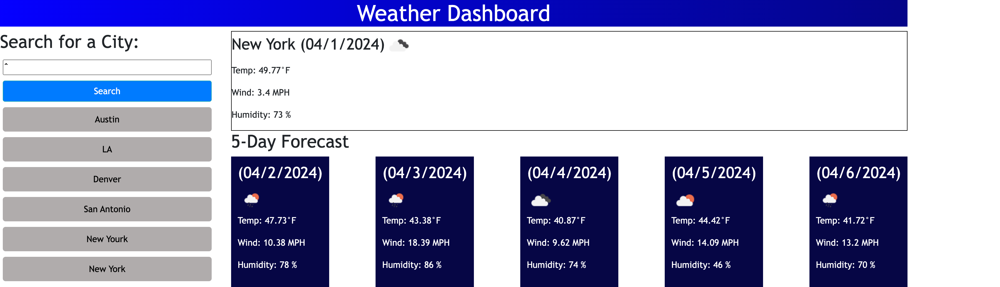

# weather-dashboard
This web-site is a Weather Dashboard

## Description
This web-site was made with HTML, CSS and JavaScript.
It helps people to to see the weather outlook for multiple cities.

## Installation
N/A

## Usage
1. Open:  
2. Enter the name of city into the form and press the "search" button. You'LL see the current and future 5 days conditions for that city and that city is added to the search history.
3. When you click on a city in the search history you will again presented with current and future conditions for that city.

## Technologies Used
- HTML
- CSS
- JavaScript

The following images show the wed-site appearance and functionality:

